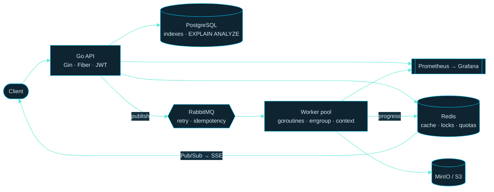

<div align="center">



<br>

<a href="https://t.me/docc_i"></a>
<a href="mailto:nkorneyenkov@gmail.com"></a>
<a href="https://youinet.ru"></a>


</div>

---

## ▍The short version

**I don't ship demos.** Everything below either has real users, moves real money, or gave real people back half an hour of their day.

Go is my working tool, not my hobby — goroutines, channels, `context` and `errgroup` are in there because throughput and cancellation matter, not because they look good in a README. I take a system the whole way: business requirement → architecture → code → tests → Docker → deploy → the 3 a.m. log that explains why it broke.

The part I'm actually proud of: **things I built are still running, and I'm still the one keeping them up.**

<div align="center">

<br>


<br>

🟢 **Live right now —** [**youinet.ru**](https://youinet.ru) · [**nikeniken.store**](https://nikeniken.store) · [**vvault.ru**](https://vvault.ru) — open them, they're real services with real users.

</div>

---

## ▍Things that are live right now

<table>
<tr>
<td width="50%" valign="top">

### 🛡️ Youinet — VPN service

**[youinet.ru](https://youinet.ru)** · [bot](https://t.me/youinet_bot)

Built it, launched it, **and still run it.** A paying subscriber base, a multi-node fleet, **millions of connections proxied a day** and terabytes of traffic — 24/7, no ops team behind me.

- Node management over API, per-user consumption accounting, speed limits
- Subscriptions, balance, auto-renewal, **two payment providers with failover**
- Payment-request **deduplication through cache** — nobody gets charged twice
- Duplicated servers for availability; deploy on push to `main`

`Go` `Fiber` `MySQL/GORM` `Xray-core` `Hysteria2` `Ansible` `systemd` `GitHub Actions`

</td>
<td width="50%" valign="top">

### 🎨 Vitrina — AI product-card generation

**[nikeniken.store](https://nikeniken.store)**

Dozens of generation jobs in parallel, and the user watches every step of it live.

- Parallel job processing: `errgroup` + RabbitMQ, dozens of tasks at once
- Live progress delivered over **Redis Pub/Sub → SSE**
- **Funds reserved for the duration of generation**, released cleanly when an external AI API fails
- Google OAuth, JWT, MinIO, Prometheus/Grafana

`Go` `Gin` `PostgreSQL/pgx` `Redis` `RabbitMQ` `MinIO/S3` `Next.js`

</td>
</tr>
<tr>
<td width="50%" valign="top">

### 🎧 VoiceVault — Dota 2 rare-item storefront

**[vvault.ru](https://vvault.ru)**

A marketplace plus the robot that keeps it stocked.

- Catalog API and admin panel on Go/Fiber, JWT, rate limiting
- Storefront with audio previews and requests for rare voice lines
- Python watcher on Steam Market: offer parsing, **price history**, proxy rotation, automated buying

`Go` `Fiber` `Python` `Playwright` `curl_cffi` `SQLite` `Next.js SSR` `Docker`

</td>
<td width="50%" valign="top">

### 📡 Telegram broadcast platform

*backend team of 5 · my services*

The one where **7M+ chats and channels** had to be indexed without the pipeline falling over.

- Proxy management, parsing and storage services — requirements to production
- Campaign state machine on RabbitMQ: retry, executor reassignment, **restart recovery, idempotency**
- Distributed **locks and quotas in Redis/Lua**
- **20× faster parsing**: account rotation, per-account limits, Redis caching
- Captcha service covering *hundreds* of variants, neural nets via OpenRouter

`Go` `Python` `MTProto` `PostgreSQL` `RabbitMQ` `Redis` `MinIO`

</td>
</tr>
</table>

---

## ▍How I wire a system



> The interesting question is never *"which framework"*. It is: what happens when the worker dies mid-task, when the payment webhook arrives twice, when the external API takes 40 seconds, and when you restart the whole thing at peak.

---

## ▍Under the hood

<details>
<summary><b>⚡ Concurrency — the part that has to be right</b></summary>

<br>

- Worker pools on goroutines and channels with `context` cancellation all the way down
- `errgroup` for fan-out where the first real error should stop the rest
- `sync` primitives where a mutex is genuinely cheaper than a channel — and I can tell you which case is which
- **Race detector and `pprof` in the loop**, not as a post-mortem tool
- Table-driven tests, because concurrency bugs hide in the case you didn't enumerate

</details>

<details>
<summary><b>🔁 Queues that don't lose work</b></summary>

<br>

- Campaign and job **state machines on RabbitMQ**: explicit states, explicit transitions
- Retry with executor reassignment when a worker disappears
- **Recovery after restart** — a process dying is a normal event, not an incident
- **Idempotency** on everything that touches money or sends a message
- Distributed locks and quotas as **Redis/Lua scripts**, so check-and-set is genuinely atomic

</details>

<details>
<summary><b>🗄️ Data that stays fast</b></summary>

<br>

- PostgreSQL and MySQL: transactions, isolation levels, migrations as code
- Query tuning with **indexes and `EXPLAIN ANALYZE`** — measured first, changed second
- Redis as cache, lock, quota and Pub/Sub bus, each with a deliberate eviction story
- Schemas designed for the read pattern that actually exists in production

</details>

<details>
<summary><b>🚀 Keeping it alive</b></summary>

<br>

- Docker + Compose, Linux, Nginx, systemd, Ansible; Kubernetes/Helm on an engineering project
- CI/CD in GitHub Actions: tests and build on every push, deploy on `main`
- **Prometheus + Grafana** metrics, and logs designed to answer questions at 3 a.m.
- Diagnosed real availability and payment incidents from logs, reproduced them in staging, shipped the fix
- Duplicated servers for failover, because one node is not a plan

</details>

<details>
<summary><b>🧪 Also in the toolbox</b></summary>

<br>

- **Python** for everything that isn't a hot path: FastAPI, asyncio, Playwright, `curl_cffi`
- Payments integrated end-to-end: **RollyPay, YooKassa, Platega** — including fallback between providers
- Google OAuth, JWT, rate limiting
- Kafka + ClickHouse + circuit breaker on an order-flow engineering project
- **Next.js** when the backend needs a face; I ship the whole product, not half of it

</details>

---

## ▍Stack

<div align="center">


</div>

|  |  |
|:--|:--|
| **Language** | Go — goroutines, channels, `context`, `sync`, `errgroup`, `pprof`, race detector |
| **HTTP** | REST, Gin, Fiber, JWT, OAuth, rate limiting, SSE, WebSocket |
| **Data** | PostgreSQL, MySQL, Redis, SQLite, ClickHouse — transactions, indexes, `EXPLAIN ANALYZE`, migrations |
| **Async** | RabbitMQ, Kafka, Redis Pub/Sub, worker pools, idempotency, circuit breaker |
| **Infra** | Docker, Linux, Nginx, Ansible, systemd, GitHub Actions, Kubernetes/Helm, MinIO/S3 |
| **Observability** | Prometheus, Grafana, structured logging, incident diagnosis from production logs |
| **Second language** | Python — FastAPI, asyncio, Playwright, MTProto |

---

## ▍Open source

### [`idempo`](https://github.com/D0CCi/idempo) — run the operation once, answer every retry

[](https://github.com/D0CCi/idempo/actions/workflows/ci.yml)
[](https://pkg.go.dev/github.com/D0CCi/idempo)
[](https://goreportcard.com/report/github.com/D0CCi/idempo)
[](https://github.com/D0CCi/idempo/blob/main/LICENSE)

Idempotency keys for Go services, extracted from the payment and message-delivery paths above — the machinery behind *"nobody gets charged twice"*, with the business logic left out.

- First caller runs the operation, duplicates replay the stored result, and a duplicate arriving **mid-flight waits instead of racing it**
- The claim is a **Lua script**, so check-and-set happens inside Redis and two workers cannot both win it
- Request fingerprints: a key reused with a different body is an error, not a silent wrong answer
- `net/http` middleware replaying status, headers and body — and deliberately **not** caching 5xx
- 64 concurrent callers on one key asserted to run the operation exactly once, under `-race` in CI
- **64 ns and zero allocations** per replay

```go
res, err := m.Do(ctx, "charge-42", idempo.Fingerprint(body), func(ctx context.Context) ([]byte, error) {
    return chargeCard(ctx, body)
})
```

### Also public

| Repo | What it is |
|:--|:--|
| [`go-user-api-service`](https://github.com/D0CCi/go-user-api-service) | Code-review assigner: clean architecture, REST, raw SQL migrations, no ORM |
| [`link-shortener`](https://github.com/D0CCi/link-shortener) | Compact Go service, the classic done properly |
| [`go-course-viewer`](https://github.com/D0CCi/go-course-viewer) | Go web server with automatic table-of-contents building |
| [`v1.0-steam_price_monitor`](https://github.com/D0CCi/v1.0-steam_price_monitor) | Steam Market price tracking with proxy rotation |
| [`v1.0-cs2-bot-afk-and-walk`](https://github.com/D0CCi/v1.0-cs2-bot-afk-and-walk) | YOLO computer vision: capture → detect → act |

---

<details>
<summary><b>🇷🇺 То же самое по-русски</b></summary>

<br>

**Go-разработчик. Веду backend целиком — от бизнес-требования до продакшена и разбора инцидента.**

Не пишу демо. Всё, что выше, либо имеет живых пользователей, либо проводит через себя реальные деньги, либо вернуло людям полчаса рабочего дня.

- **Youinet** — [youinet.ru](https://youinet.ru): собственный VPN-сервис. Платящая аудитория, мультинодовый флот, **миллионы соединений в сутки** и терабайты трафика, 24/7 без отдельной команды эксплуатации. Подписки, баланс, автопродление, два платёжных провайдера с резервированием, дедупликация платёжных запросов.
- **Vitrina** — [nikeniken.store](https://nikeniken.store): AI-генерация карточек товаров. Десятки параллельных задач на `errgroup` + RabbitMQ, прогресс в реальном времени через Redis Pub/Sub и SSE, резервирование средств на время генерации.
- **VoiceVault** — [vvault.ru](https://vvault.ru): витрина редких предметов Dota 2 плюс Python-мониторинг Steam Market с ротацией прокси и автоматизацией покупок.
- **Платформа Telegram-рассылок** (backend-команда из 5): сервисы прокси, парсинга и хранения **7+ млн чатов и каналов**; состояния кампаний на RabbitMQ с retry, переназначением исполнителей, восстановлением после рестарта и идемпотентностью; блокировки и квоты на Redis/Lua; **ускорение парсинга до 20 раз**.

**Open source:** [**idempo**](https://github.com/D0CCi/idempo) — идемпотентность для Go-сервисов: атомарный claim на Redis/Lua, ожидание вместо гонки для дубля на лету, отпечатки запроса и middleware для `net/http`. Вынесено из платёжного контура, 64 нс на повтор без аллокаций, тесты под `-race` в CI.

**Чем занимаюсь по-настоящему:** конкурентность, за которую не стыдно (goroutines, channels, `context`, `errgroup`, race detector, `pprof`), очереди, которые не теряют задачи, запросы, ускоренные по `EXPLAIN ANALYZE`, и инфраструктура, которая переживает рестарт.

**Открыт к предложениям:** высоконагруженный Go-backend. Москва, гибрид или удалённо. Английский B2.

📬 [t.me/docc_i](https://t.me/docc_i) · [nkorneyenkov@gmail.com](mailto:nkorneyenkov@gmail.com)

</details>

---

<div align="center">

### Looking for someone who ships it and then keeps it running?

Don't take my word for it — [**youinet.ru**](https://youinet.ru) has been up the whole time you've been reading this.

**[→ Telegram @docc_i](https://t.me/docc_i)**  ·  **[→ nkorneyenkov@gmail.com](mailto:nkorneyenkov@gmail.com)**

<sub>Go backend · high-load · distributed systems · Moscow, hybrid or remote · English B2</sub>

</div>
