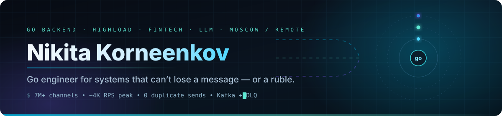
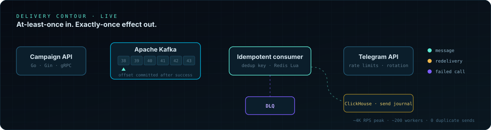

<div align="center">



<br>

<a href="https://t.me/docc_i"></a>
<a href="mailto:nkorneyenkov@gmail.com"></a>
<a href="https://youinet.ru"></a>


</div>

---

## ▍The short version

**Go engineer for the part of the system that isn't allowed to fail** — money, message delivery, and anything that has to survive a restart at peak load.

3+ years of commercial Go. I take a service the whole way: data model and API contracts → concurrency → tests → CI/CD → Kubernetes → the trace that explains the 3 a.m. incident. And I measure before I optimise.

<div align="center">

<br>


<br>

🟢 **Live right now —** [**youinet.ru**](https://youinet.ru) · [**nikeniken.store**](https://nikeniken.store) · [**vvault.ru**](https://vvault.ru) — open them, they're real services with real users.

</div>

---

## ▍What I'm good at

<table>
<tr>
<td width="50%" valign="top">

### 📨 Delivery that never double-sends

A Kafka contour where *"the consumer died after sending but before committing"* is a normal Tuesday, not an incident. Offsets committed only after success, an idempotent consumer, DLQ for whatever fails downstream.

**→ zero duplicate sends under redelivery.**

</td>
<td width="50%" valign="top">

### ⚡ Throughput inside someone else's limits

~200 workers, ~4K RPS peak, and an external API that bans you for being greedy. Atomic quotas and locks in **Redis Lua** made the limit hold at *any* worker count.

**→ 20× faster collection; `pprof` found a goroutine leak worth 15% of memory.**

</td>
</tr>
<tr>
<td width="50%" valign="top">

### 💰 Money that adds up

Billing built from scratch: `decimal` math, idempotent recalculation, back-dated events become correction entries instead of silent edits to closed periods. Payment webhooks that arrive twice and still charge once.

**→ month-close went from days to hours.**

</td>
<td width="50%" valign="top">

### 🧩 Architecture that survives a pivot

Split a monolith into Go/gRPC services with their own schemas and contracts — the product later turned into a different business on the same foundation. PostgreSQL at hundreds of GB, ClickHouse for analytics, LLMs with structured output where they actually pay off.

**→ new product, no infrastructure rewrite.**

</td>
</tr>
</table>



> The interesting question is never *"which framework"*. It is: what happens when the consumer dies between the side effect and the offset commit, when the payment webhook arrives twice, when the external API starts returning 429 at 200 workers — and when you restart the whole thing at peak.

### Track record

| | | |
|:--|:--|:--|
| **2025 – 2026** | **Naimster** · Telegram AdTech platform | Led the data-collection direction. Monolith → event-driven microservices, 7M+ channels, Kafka, Kubernetes, LLM pipelines |
| **2023 – 2025** | **Realgrupp** · railway operator, internal fintech | From Python automation to key backend engineer: rental billing for 2 000+ railcars, ETL from Russian Railways, Python → Go |

---

## ▍Open-source contributions

Real bugs, found by reading the code, fixed with root-cause analysis and regression tests.

### [Infisical/agent-vault](https://github.com/Infisical/agent-vault) 

*Go HTTP credential proxy & vault for AI agents (Claude Code and others) — MITM relay, credential injection, rate limiting.*

| PR | What was wrong → what I did | |
|:--|:--|:--|
| [#438](https://github.com/Infisical/agent-vault/pull/438) | A 401 from a `passthrough` service was relayed with headers and `Content-Length` but **zero body bytes** — the OAuth retry closed the original body up front. Traced the branch condition, kept the body intact when the retry is skipped or fails |  |
| [#439](https://github.com/Infisical/agent-vault/pull/439) | Upstream failures mid-body were swallowed: **chunked responses reached the client truncated with a clean EOF**. Added a read-error recorder, `upstream_body_error` in the request log, connection abort via `http.ErrAbortHandler` |  |
| [#437](https://github.com/Infisical/agent-vault/pull/437) | Rate-limit denials at the CONNECT/forward pre-gate left **no log and no trace** during incidents. Added logging **throttled per key** with a bounded map (4096 keys + overflow bucket) so a flood can't amplify into the log pipeline |  |
| [#436](https://github.com/Infisical/agent-vault/pull/436) | Without an Infisical client, vaults reported `sync ok` **forever**. Syncer now always runs; unrefreshed rows are marked stale after two intervals, avoiding the typed-nil-interface trap |  |

### [1712n/dn-institute](https://github.com/1712n/dn-institute) — [#1214](https://github.com/1712n/dn-institute/pull/1214) 

Trade-feed validator for a **pipeline-integrity** challenge: every raw row gets exactly one outcome — *accepted*, *duplicate* (with the canonical event it copies) or *dead letter* (reason codes + untouched raw row, ready for replay). Catches redeliveries under a new `event_id`, null block times, events ingested before their block existed, and out-of-order arrival.

---

## ▍My open source

### [`idempo`](https://github.com/D0CCi/idempo) — run the operation once, answer every retry

[](https://github.com/D0CCi/idempo/actions/workflows/ci.yml)
[](https://pkg.go.dev/github.com/D0CCi/idempo)
[](https://goreportcard.com/report/github.com/D0CCi/idempo)
[](https://github.com/D0CCi/idempo/blob/main/LICENSE)

Idempotency keys for Go services, extracted from the payment-webhook and message-delivery paths above — the machinery behind *"nobody gets charged twice"*, with the business logic left out.

- First caller runs the operation, duplicates replay the stored result, and a duplicate arriving **mid-flight waits instead of racing it**
- The claim is a **Lua script**, so check-and-set happens inside Redis and two workers cannot both win it
- Request fingerprints: a key reused with a different body is an error, not a silent wrong answer
- `net/http` middleware replaying status, headers and body — and deliberately **not** caching 5xx
- 64 concurrent callers on one key asserted to run the operation exactly once, under `-race` in CI
- **64 ns and zero allocations** per replay

```go
res, err := m.Do(ctx, "charge-42", idempo.Fingerprint(body), func(ctx context.Context) ([]byte, error) {
    return chargeCard(ctx, body)
})
```

| Repo | What it is |
|:--|:--|
| [`transport-check`](https://github.com/D0CCi/transport-check) | CLI that shows which transports (TCP/TLS/HTTP2/QUIC/UDP) actually reach a host, and where each one stopped |
| [`go-user-api-service`](https://github.com/D0CCi/go-user-api-service) | Code-review assigner: clean architecture, REST, raw SQL migrations, no ORM |
| [`link-shortener`](https://github.com/D0CCi/link-shortener) | Compact Go service, the classic done properly |
| [`v1.0-cs2-bot-afk-and-walk`](https://github.com/D0CCi/v1.0-cs2-bot-afk-and-walk) | YOLO computer vision: capture → detect → act |

---

## ▍Side products — live, with real users

<table>
<tr>
<td width="33%" valign="top">

### 🛡️ [Youinet](https://youinet.ru)

VPN service I built and **still run solo**: multi-node fleet, **millions of connections a day**, paying subscribers. Subscriptions, auto-renewal, **two payment providers with failover**, payment dedup.

`Go` `Fiber` `MySQL` `Xray` `Hysteria2` `Ansible` `GitHub Actions`

</td>
<td width="33%" valign="top">

### 🎨 [Vitrina](https://nikeniken.store)

AI product-card generation: dozens of jobs in parallel on `errgroup` + RabbitMQ, **live progress via Redis Pub/Sub → SSE**, funds reserved for the generation and released cleanly on AI-API failure.

`Go` `Gin` `pgx` `Redis` `RabbitMQ` `MinIO` `Next.js`

</td>
<td width="33%" valign="top">

### 🎧 [VoiceVault](https://vvault.ru)

Dota 2 rare-item storefront + a Python watcher on Steam Market: offer parsing, price history, proxy rotation, automated buying.

`Go` `Fiber` `Python` `Playwright` `Next.js SSR` `Docker`

</td>
</tr>
</table>

---

## ▍Stack

<div align="center">


</div>

|  |  |
|:--|:--|
| **Go** | goroutines, channels, `context`, worker pools, `errgroup`, `pprof`, race detector · Gin, chi, pgx, sqlc, goose, testify, table-driven tests |
| **Architecture** | microservices, event-driven, monolith decomposition, Clean Architecture, DDD, system design for highload |
| **Reliability** | idempotency, at-least-once delivery, Retry with exponential backoff, DLQ, circuit breaker, rate limiting, distributed locks, graceful shutdown |
| **Messaging** | Apache Kafka (consumer groups, offset management, idempotent consumer, DLQ), RabbitMQ, Redis Pub/Sub |
| **Data** | PostgreSQL (schema design, indexes, transactions, isolation levels, locks), Redis (Lua), ClickHouse, MinIO/S3 |
| **API** | REST, gRPC, Protobuf, OpenAPI/Swagger, webhooks, OAuth 2.0, JWT, SSE |
| **Testing** | unit & integration tests, Testcontainers, testify, golangci-lint |
| **DevOps & observability** | Docker, Kubernetes, Helm, GitLab CI/CD, GitHub Actions, Linux, OpenTelemetry, Prometheus, Grafana |
| **LLM & AI** | OpenRouter (OpenAI-compatible API), structured output (JSON Schema), batch processing, token-cost control · Claude Code daily, MCP |
| **Also** | Python (FastAPI, asyncio, Playwright), payments: YooKassa, RollyPay, Platega |

---

<details>
<summary><b>🇷🇺 По-русски</b></summary>

<br>

**Go-разработчик, 3+ года коммерческой разработки.** Делаю ту часть системы, которой нельзя падать: деньги, доставку сообщений и всё, что должно пережить рестарт на пике.

- **Доставка без дублей** — контур на Kafka: offset только после успеха, идемпотентный консьюмер, DLQ. Повторная доставка не превращается в повторную отправку.
- **Нагрузка в чужих лимитах** — ~200 воркеров, пик ~4K RPS, квоты и блокировки на Redis Lua. Сбор данных быстрее в 20×, утечка горутин найдена через `pprof` (−15% памяти).
- **Деньги сходятся** — биллинг с нуля на `decimal`, идемпотентный пересчёт, корректировки вместо правки закрытых периодов. Закрытие месяца — с дней до часов.
- **Архитектура переживает пивот** — монолит разделён на Go/gRPC-сервисы, продукт сменил бизнес без переписывания инфраструктуры.

**2025 – 2026** Naimster — AdTech на Telegram, руководил направлением сбора данных · **2023 – 2025** Реалгрупп — финансовые системы ж/д-оператора.

**Open source:** 4 PR с разбором root cause в [Infisical/agent-vault](https://github.com/Infisical/agent-vault) (~2.3k★), валидатор целостности пайплайна в dn-institute, своя библиотека [**idempo**](https://github.com/D0CCi/idempo) — идемпотентность на Redis/Lua, 64 нс на повтор без аллокаций.

**Открыт к предложениям:** высоконагруженный Go-backend. Москва, гибрид или удалённо. Английский B2.

📬 [t.me/docc_i](https://t.me/docc_i) · [nkorneyenkov@gmail.com](mailto:nkorneyenkov@gmail.com)

</details>

---

<div align="center">

### Looking for someone who ships it and then keeps it running?

Don't take my word for it — [**youinet.ru**](https://youinet.ru) has been up the whole time you've been reading this.

**[→ Telegram @docc_i](https://t.me/docc_i)**  ·  **[→ nkorneyenkov@gmail.com](mailto:nkorneyenkov@gmail.com)**

<sub>Go backend · high-load · distributed systems · Moscow, hybrid or remote · English B2</sub>

</div>
